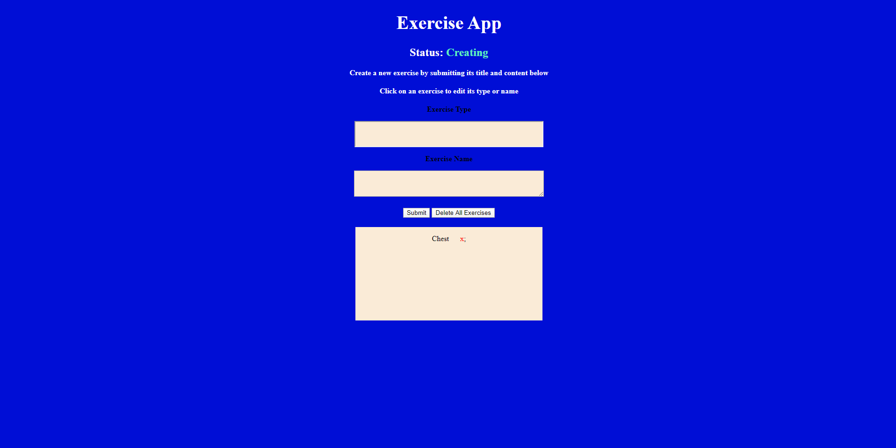
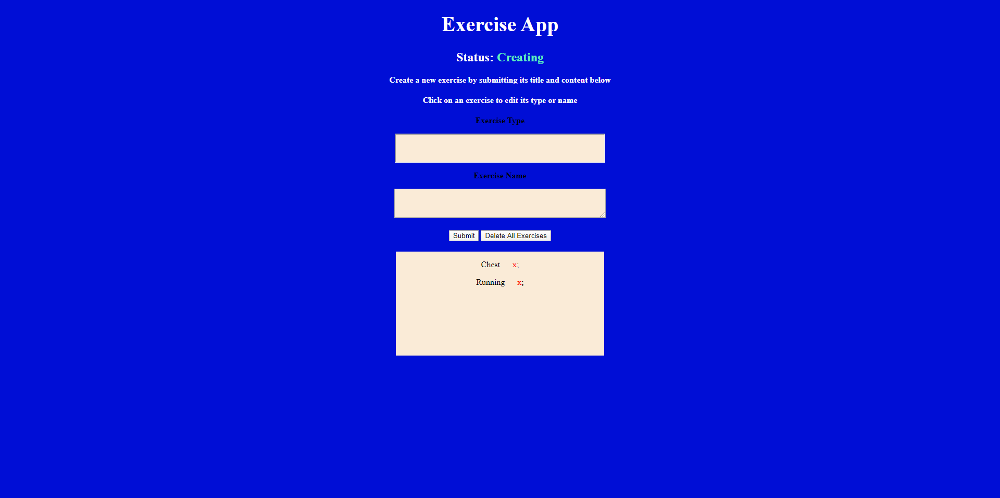

# Fitness Tracker

## User Story
    As a user, I want the ability to add exercises and update exercises, so that I can keep track of my workout progress.

## Visuals

  

	
### Photo Descriptions
    The user comes to the webpage and has two input fields to fill out. The "Exercise Type" and the "Exercise Name".

    After the user inserts the type and name they click submit to save the exercise in the text box below.

    After it is saved they have the option to update the exercise by clicking on it and updating it.
    
## Usage
    Users looking for an app that will track their progress for different exercises.
   
## Links 

[Fitness Tracker](https://fathomless-dawn-05559.herokuapp.com/)
